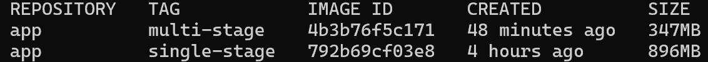

# SMS Checker / Frontend

Application service with frontend and backend for SMS checker
The frontend allows users to interact with the model in the backend through a web-based UI.

The frontend is implemented with Spring Boot and only consists of a website and one REST endpoint.
It **requires Java 25+** to run (tested with 25.0.1).
Any classification requests will be delegated to the `backend` service that serves the model.
You must specify the environment variable `MODEL_HOST` to define where the backend is running.

The frontend service can be started through running the `Main` class (e.g., in your IDE) or through Maven (recommended):

    MODEL_HOST="http://localhost:8081" mvn spring-boot:run

The server runs on port 8080. Once its startup has finished, you can access [localhost:8080/sms](http://localhost:8080/sms) in your browser to interact with the application.

## lib-version Integration (F1)

This application integrates the [lib-version](https://github.com/doda25-team9/lib-version) library to track and display library versions at runtime.

### What is lib-version?

lib-version is a version-aware Maven library developed by DODA25 Team 9. It provides a simple `VersionUtil` class that allows applications to retrieve library version information at runtime.

### How Versioning Works

The lib-version library demonstrates a complete version management workflow:

1. **Version Definition:** The version is defined in lib-version's `pom.xml`:
```xml
   <version>1.0.0-SNAPSHOT</version>
```

2. **Automated Release:** When a Git tag is pushed (e.g., `v1.0.0`):
   - GitHub Actions workflow triggers
   - Extracts version from the tag
   - Updates `pom.xml` and `version.properties`
   - Builds the JAR with version embedded in MANIFEST.MF
   - Publishes to GitHub Packages

3. **Runtime Detection:** The library includes the version in two places:
   - JAR's `META-INF/MANIFEST.MF` (Implementation-Version)
   - `version.properties` resource file (development fallback)

4. **App Integration:** This app depends on a specific version in its `pom.xml`:
```xml
   <dependency>
       <groupId>com.doda25.team9</groupId>
       <artifactId>lib-version</artifactId>
       <version>0.1.0-test</version>
   </dependency>
```

5. **Runtime Display:** When the app starts, `VersionUtil.getVersion()` reads the version from the JAR and displays it:
```
   Using lib-version: 0.1.0-test
```

This demonstrates the complete lifecycle: **version definition → automated release → package distribution → runtime usage**.

### Required Setup (First Time Only)

**GitHub Packages requires authentication.** Configure it once, use it everywhere.

#### Step 1: Create GitHub Personal Access Token

1. Go to [GitHub Settings → Tokens](https://github.com/settings/tokens)
2. Click **"Generate new token (classic)"**
3. Configure token:
   - Name: `maven-packages-access`
   - Expiration: 90 days (or your preference)
   - Required scope: ☑ `read:packages`
4. Click **"Generate token"**
5. **Copy the token** (starts with `ghp_`) - you won't see it again!

#### Step 2: Configure Maven Settings

Create or edit `~/.m2/settings.xml` on your computer:
```xml
<settings xmlns="http://maven.apache.org/SETTINGS/1.0.0"
          xmlns:xsi="http://www.w3.org/2001/XMLSchema-instance"
          xsi:schemaLocation="http://maven.apache.org/SETTINGS/1.0.0
                              http://maven.apache.org/xsd/settings-1.0.0.xsd">
  <servers>
    <server>
      <id>github</id>
      <username>YOUR_GITHUB_USERNAME</username>
      <password>YOUR_GITHUB_TOKEN</password>
    </server>
  </servers>
</settings>
```

**Replace:**
- `YOUR_GITHUB_USERNAME` with your GitHub username
- `YOUR_GITHUB_TOKEN` with the token you copied (starts with `ghp_`)

**Important:** The `<id>github</id>` matches the repository ID in this app's `pom.xml`, allowing Maven to automatically use these credentials when downloading lib-version.

**Note:** This is a one-time setup. Once configured, Maven can download any GitHub Packages dependency from any project.

### What You'll See at Startup

When the application starts, it displays the lib-version:
```
Using lib-version: 0.1.0-test

  .   ____          _            __ _ _
 /\\ / ___'_ __ _ _(_)_ __  __ _ \ \ \ \
( ( )\___ | '_ | '_| | '_ \/ _` | \ \ \ \
...
```

This proves:
- The app successfully depends on lib-version as an external library
- Maven downloaded lib-version from GitHub Packages
- The library version is correctly embedded in the JAR
- `VersionUtil.getVersion()` retrieves the version at runtime

### Version Correspondence

The version displayed (`0.1.0-test`) corresponds to:
- **lib-version release:** Created when tag `v0.1.0-test` was pushed
- **GitHub Packages:** Published as `com.doda25.team9:lib-version:0.1.0-test`
- **This app's dependency:** Specified in `pom.xml` as `<version>0.1.0-test</version>`
- **Runtime output:** Retrieved via `VersionUtil.getVersion()`

This demonstrates the full integration from release to runtime usage.

### Troubleshooting

**Error: `401 Unauthorized` when building**

Maven authentication is not configured.

**Solution:** Follow steps 1 and 2 above to configure your GitHub token in `~/.m2/settings.xml`.

**Error: `Could not find artifact com.doda25.team9:lib-version:jar:X.Y.Z`**

The specified version doesn't exist in GitHub Packages.

**Solution:** 
- Check available versions: [lib-version packages](https://github.com/doda25-team9/lib-version/packages)
- Verify the version in `pom.xml` matches an existing release
- Common versions: `0.1.0-test` (test), `1.0.0` (stable)

**Version shows "unknown"**

The JAR is missing version information.

**Solution:** This shouldn't happen with properly released versions from GitHub Packages. If it does, the lib-version release workflow may have failed.

### For More Information

- [lib-version repository](https://github.com/doda25-team9/lib-version) - Library source code
- [lib-version releases](https://github.com/doda25-team9/lib-version/releases) - Available versions
- [lib-version packages](https://github.com/doda25-team9/lib-version/packages) - Published artifacts

## Docker Support (F3 & F6)

Build the Docker image:

```bash
docker build -t app:latest .
```

Run the container:

```bash
docker run -p 8080:8080 app:latest
```

Access the application at: http://localhost:8080/sms

Or you can specify the environment variables:

- `APP_PORT` - sets the port the frontend server runs on (default set to `8080`)
- `MODEL_HOST` - specifies where backend service is running (default set to `http://localhost:8081`)

For example

```bash
docker run -p 8085:8085 -e APP_PORT=8085 -e MODEL_HOST=http://localhost:8082 app:latest
```

## Multi-Architecture Support (F4)

This Docker image supports multiple CPU architectures, allowing it to run on different types of processors.

### Supported Architectures

- **linux/amd64** - Intel and AMD 64-bit processors (most servers and PCs)
- **linux/arm64** - ARM 64-bit processors (Apple Silicon Macs, AWS Graviton, Raspberry Pi)

### Implementation Details

We use **QEMU emulation** (Strategy 1 from Docker's multi-platform documentation):

- QEMU is built into Docker Desktop
- No Dockerfile changes required
- E.g. a Mac can emulate Intel processors to build AMD64 images and both architectures are built on a single machine

When users pull the image with `docker pull <image-name>`, Docker automatically downloads the correct version for their processor architecture.

### How to Build Multi-Architecture Images

**Prerequisites:**

- Docker Desktop with Buildx (included by default)

**Setup (first time only):**

Before building multi-architecture images, create a specialized builder:

```bash
docker buildx create --name multiarch-builder --use
docker buildx inspect --bootstrap
```

You only need to run these commands once on your machine. After this, the builder persists and you can use it anytime.

---

**For Development & Testing:**

When working locally and testing your changes, build for your computer's architecture:

```bash
# On Apple Silicon Macs (M1/M2/M3)
docker buildx build --platform linux/arm64 -t app:latest --load .

# On Intel/AMD computers
docker buildx build --platform linux/amd64 -t app:latest --load .
```

The `--load` flag makes the image available to run with `docker run` on your local machine. You can only load one architecture at a time because your computer can only run its native architecture efficiently.

**Then run it:**

```bash
docker run -p 8080:8080 -e MODEL_HOST=http://localhost:8081 app:latest
```

---

**For Production/Release:**

When releasing the application, build for both architectures:

```bash
docker buildx build --platform linux/amd64,linux/arm64 -t app:latest --push
```

This command:

- Builds for both Intel (amd64) and ARM (arm64) processors
- Creates a multi-platform image manifest
- Pushes both versions to a container registry (requires `--push` instead of `--load`)

Note: You cannot use `--load` with multiple platforms. Multi-architecture images must be pushed to a registry (like GitHub Container Registry or Docker Hub) to be useful.

### F4 Testing

Tested multi-architecture builds successfully:

- Built for both amd64 and arm64 simultaneously
- Verified AMD64 image runs on ARM64 Mac (with expected platform warning)
- Confirmed ARM64 native build works without warnings

### F5 Multi-Stage Builds

Improved Docker image by dividing it into:

- Builder stage: Maven and JDK 25
- Final stage: slim JRE 25 Alpine

This led to a drastic change in the image size

| Build Type   | Image Size |
| ------------ | ---------- |
| Single-stage | 896 MB     |
| Multi-stage  | 347 MB     |

_Screenshot Proof_


## Automated Container Image Releases (F8)

The repository includes a Github Actions workflow (`.github/workflows/release.yml`) that automatically builds and publishes versioned container images of the app repository to the GitHub Container Registry (GHCR).

### Single Source of Truth for Versions

The version of the apploication is defined in the project's Maven metadata:
`pom.xml`
Example:
`<version>0.0.1-SNAPSHOT</version>`

This `version` field acts as the single source of truth for the application's version.
Whenever a new release is required, the version is updated only in this file, and the workflow handles the rest.

### How the Workflow Works

This workflow is triggered whenever a new Git tag matching the pattern `v*` is pushed.
Once triggered, the pipeline executes the following steps:

1. Checks out the repository
2. Reads the version from the `<version>` field in `pom.xml` using Maven tooling
3. Builds a multi-architecture Docker image for `linux/amd64` and `linux/arm64`
4. Tags the image using the extracted version:
   `ghcr.io/doda25-team9/app:<version>`
5. Also tags and updates the `latest` tag
6. Pushes both tags to GHCR

### Viewing Published Images

Released images are available at:
`https://github.com/doda25-team9/app/pkgs/container/app`

### Running a Released Image

To run a published release:

```
docker pull ghcr.io/doda25-team9/app:<version>
docker run -p 8080:8080 -e MODEL_HOST=http://localhost:8081 ghcr.io/doda25-team9/app:<version>

```
